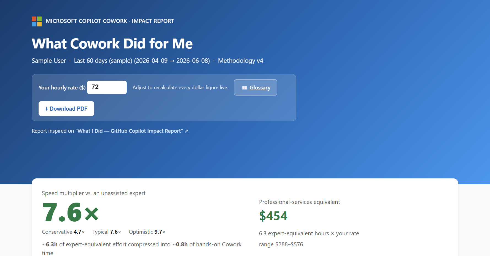
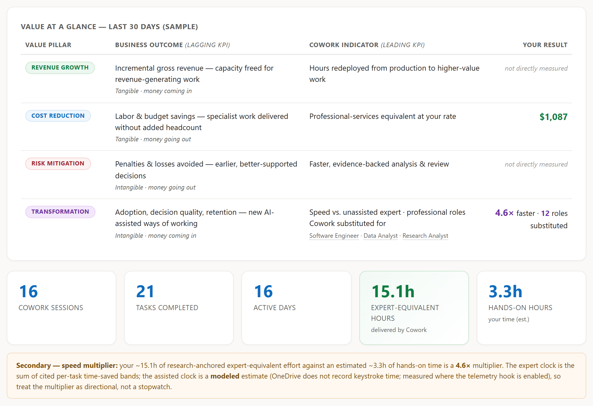
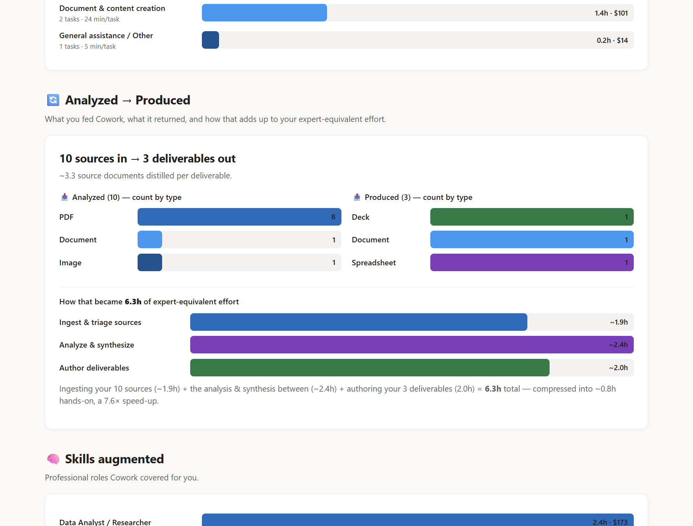

# What Cowork Did for Me

> A personal impact report skill for **Microsoft Copilot Cowork** — quantifies your leverage as a speed multiplier and professional-services equivalent value.



---

## What is this?

**"What Cowork Did for Me"** is a skill for [Copilot Cowork](https://copilot.cloud.microsoft/cowork) that generates a polished, Microsoft-branded **single-file HTML report** from your own Cowork session history stored in OneDrive. It answers the question: *"How much time and value has Cowork given me?"*

The skill:
- Harvests your Cowork session artifacts (inputs analyzed & outputs produced) from OneDrive
- Classifies work into 8 research-anchored task categories
- Applies an **artifact-scaled two-clock model** to compute your speed multiplier
- Correlates each task with its **Copilot-credit cost** and reports **ROI on that spend**
- Renders a self-contained, interactive HTML report you can share or print to PDF

Inspired by [microsoft/What-I-Did-Copilot](https://github.com/microsoft/What-I-Did-Copilot), adapted for Copilot Cowork.

---

## Download

| Version | File | Status |
|---|---|---|
| **v10** | [`cowork-roi-report-skill-v10-latest.zip`](cowork-roi-report-skill-v10-latest.zip) | ✅ **Latest version** — recommended |
| v5.2 | [`cowork-roi-report-skill-v5.2-previous.zip`](cowork-roi-report-skill-v5.2-previous.zip) | Previous version (kept for reference) |

### What's new in v10 — Credits & ROI

Cowork is now metered in **Copilot Credits** ($0.01 each), so v10 reinstates **ROI** — framed against
the real cost of the work:

1. **Each task is correlated with its credit cost.** Credits are **measured** live from the `/cost`
   reading (e.g. *"556.1 credits used for this task so far."*) or **estimated** from inputs, outputs and
   task category when no reading exists.
2. **The estimator self-calibrates** to any measured values via a single global scale factor, so modeled
   sessions track real spend.
3. **New report section "Credits & ROI"** + two KPI tiles (Credits used, ROI) + a **Credits column** in
   the work-by-process table, with a measured/estimated badge.
4. **ROI = professional-services value ÷ credit cost** and recalculates live with the hourly-rate control.

v10 also folds in the v6→v9 improvements (APQC-anchored business-process stamping, session-aware
categories, and value pillars). See [`skill/CHANGELOG-v7.md`](skill/CHANGELOG-v7.md),
[`skill/CHANGELOG-v6.md`](skill/CHANGELOG-v6.md) and [`skill/CHANGELOG-v5.md`](skill/CHANGELOG-v5.md).

---

## Report Highlights

### Speed Multiplier & Value
The report leads with a **speed multiplier** (how much faster Cowork made you vs. working unassisted) and a **professional-services equivalent** (what that expert time would cost at your hourly rate).



### Category Breakdown & Analyzed → Produced
See where your time went across 8 task categories, plus a breakdown of what you fed Cowork vs. what it produced.



### Full Report Sections
- **Hero** — speed multiplier (conservative/typical/optimistic) + professional-services value
- **KPIs** — sessions, tasks, active days, expert-equiv hours, hands-on hours, **credits used, ROI**
- **By category** — research-anchored time-savings bars
- **Analyzed → Produced** — sources in vs. deliverables out, with ingest/synthesize/author split
- **Credits & ROI** — Copilot credits consumed + their $ cost, ROI on spend, net value, and credits by category
- **Skills augmented** — professional roles Cowork covered for you
- **Work by business process** — each goal mapped to the business process it advanced, its category, project, assistance, **and the credits it cost**
- **Activity heatmap** — day × hour collaboration pattern
- **Methodology & glossary** — every band traceable, with clickable research sources
- **Live hourly-rate control** — recalculates all dollar figures and ROI; speed multiplier and credit counts are rate-independent
- **Download PDF** button

---

## Installation

### Option 1 — Let Cowork install it for you (easiest)

1. **Download** the latest version: [`cowork-roi-report-skill-v10-latest.zip`](cowork-roi-report-skill-v10-latest.zip)
2. **Open** [Copilot Cowork](https://copilot.cloud.microsoft/cowork)
3. **Attach** the zip file to the chat and send this prompt:

   > **Install the attached Cowork ROI Report skill into my personal skills.**

4. Cowork will unpack and place the skill in the right location for you
5. **Done!** In the same session (or a new one), ask: *"What did Cowork do for me?"*

### Option 2 — Manual install

1. **Download** the latest version: [`cowork-roi-report-skill-v10-latest.zip`](cowork-roi-report-skill-v10-latest.zip)
2. **Extract** the zip
3. **Copy** the `cowork-roi-report-skill/` folder to your Cowork skills directory:
   ```
   <OneDrive>/Documents/Cowork/skills/cowork-roi-report-skill/
   ```
4. **Done!** Ask Cowork: *"What did Cowork do for me?"* or *"My Cowork ROI report"*

#### Alternative paths
- Cowork container: `/mnt/user-config/.claude/skills/cowork-roi-report-skill/`
- Custom skills folder: wherever your Cowork instance reads personal skills from

---

## How to Use

Once installed, trigger the skill by asking Cowork:
- *"What did Cowork do for me?"*
- *"My Cowork ROI report"*
- *"Cowork impact report"*
- *"How much time has Copilot Cowork saved me this month?"*

The skill will:
1. **Ask** which period to measure (7, 15, or 30 days) and whether to automate
2. **Harvest** your Cowork session files from OneDrive
3. **Classify** each session using the deterministic extension-based classifier
4. **Compute** the two-clock model (expert clock vs. assisted clock) plus the credit/ROI model
5. **Render** a beautiful HTML report with credits, ROI and the speed multiplier
6. **Optionally automate** on a recurring schedule with email digest

---

## Methodology

The skill uses a **two-clock model** anchored in published research:

| Clock | What it measures |
|---|---|
| **Expert (unassisted)** | How long a professional would take without AI — research-anchored category bands + reading time per source + authoring time per deliverable |
| **Assisted (your time)** | Modeled hands-on effort: `8 min + 2 min × (inputs + outputs)`, floor 4 min |

```
speed_multiplier            = Σ expert_min / Σ assisted_min        (rate-independent)
professional_services_value = (Σ expert_min / 60) × hourly_rate
credit_cost                 = Σ credits × $0.01
ROI                         = professional_services_value / credit_cost
```

### Credits & ROI

Each task is correlated with the **Copilot credits** it consumed. Credits are **measured** when a
`/cost` reading was captured during the run (mined via `mine_session.py --credits`), and **estimated**
otherwise — modeled from inputs, outputs and task category, then calibrated to any measured values with
a single global scale factor (clamped 0.5×–2.0×). At $0.01/credit, the report shows the credit cost, the
return on that spend, and net value. Treat estimated credits as directional.

### Research-anchored category bands (min saved / task)

| Category | Low | Typical | High |
|---|---:|---:|---:|
| Analysis & Research | 30 | **71** | 92 |
| Document & content creation | 12 | **24** | 42 |
| Email workflows | 3 | **7** | 12 |
| Meeting workflows | 12 | **31** | 45 |
| Communication workflows | 2 | **4** | 6 |
| Specialized workflows | 10 | **25** | 40 |
| Write or debug code | 30 | **56** | 96 |
| General assistance / Other | 2 | **5** | 8 |

Sources: Stanford-WB, Microsoft Research, NBER, Forrester — all clickable in the report's Glossary.

---

## What's in the Skill

```
cowork-roi-report-skill/
├── SKILL.md              # Skill definition + workflow (loaded by Cowork)
├── README.md             # Technical documentation
├── CHANGELOG-v5.md       # Speed-multiplier / professional-services value (v5)
├── CHANGELOG-v6.md       # Business-process stamping + session-aware categories (v6)
├── CHANGELOG-v7.md       # Copilot Credits cost + ROI on spend (v7)
├── scripts/
│   ├── mine_session.py   # Mines the live session transcript + /cost credits
│   ├── classify.py       # Deterministic ext→category classifier
│   ├── compute.py        # Applies the methodology + credit/ROI model → payload JSON
│   ├── apqc_taxonomy.json # APQC-anchored business-process taxonomy
│   └── build_report.py   # Renders the self-contained HTML report
└── examples/
    ├── sample_sessions.json   # Synthetic input (safe to share)
    └── sample-report.html     # Rendered from the synthetic input
```

No third-party dependencies — **standard-library Python 3 only**.

---

## Caveats

- The **assisted clock is modeled**, not measured — OneDrive records artifacts, not keystroke time. Treat the multiplier as **directional**, not a stopwatch.
- **Credits are measured only when a `/cost` reading was captured** during the run; otherwise they are modeled estimates calibrated to whatever measured values exist. Treat estimated credit costs as directional too.
- Categories with **no saved artifacts** in the window report **zero** — keeping totals a conservative floor.
- Counting stays conservative: ~2 run tasks per session; supporting files folded into the primary task.

---

## License

MIT

---

## Credits

- Inspired by [microsoft/What-I-Did-Copilot](https://github.com/microsoft/What-I-Did-Copilot)
- Powered by [Microsoft Copilot Cowork](https://copilot.cloud.microsoft/cowork)
